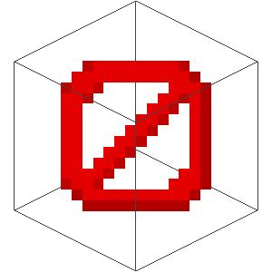

# Xakkit
<p align="center">
  
</p>
<p align="center">
  <b>Lightweight, Stable, and Nothing</b>
</p>

### Introduce
Xakkit is a server software for Minecraft: Bedrock Edition and Minecraft: Java Edition. Open source Minecraft Server written in dream

### Feature
 - [x] No software
 - [x] Full Gameplay (Redstone, MobAI, Multiworld, etc)
 - [x] Multiversion
 - [x] Free Lag
 - [x] Anti DDOS
 - [x] Anti Bot
 - [x] Anti Cheat
 - [x] Anti Hack
 - [x] Anti Mod
 - [x] Stable
 - [x] Lightweight and fast
 - [x] Multi Edition (Bedrock and Java)
 - [x] Unlimited Control
 - [x] Customizable
 - [x] Support All Plugins from Another Server Software Minecraft
 - [x] Support All OS
 - [x] Support All Device

### Installation
 ```
$ git clone https://github.com/Xakkit/Xakkit.git
$ cd Xakkit
$ echo Nothing!
```

### Sponsor
> You want?
